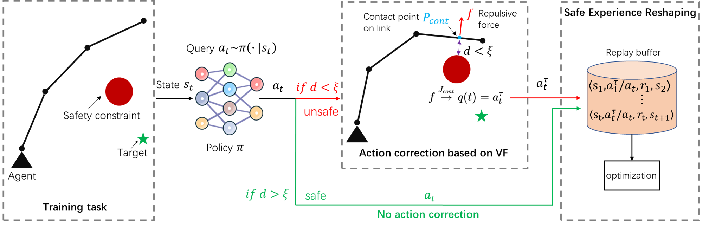

# Integrating Reinforcement Learning and Virtual Fixtures for Safer Automatic Robotic Surgery


## Table of Contents

- [Introduction](#introduction)
- [Installation](#installation)
- [Usage](#usage)
- [Datasets](#datasets)
- [Results](#results)
- [Contributing](#contributing)
- [License](#license)
- [Contact](#contact)

## Introduction

This repository provides the code and resources necessary to reproduce the results of our research paper, "[Your Paper Title](link-to-your-paper)". The paper explores [brief description of the research and its significance].

## Installation

To get started, clone the repository and install the required dependencies.

### Prerequisites

- Python 3.8+
- [List any other prerequisites, such as specific libraries, tools, or frameworks]

### Clone the Repository

```bash
git clone https://github.com/your-username/your-repository.git
cd your-repository
